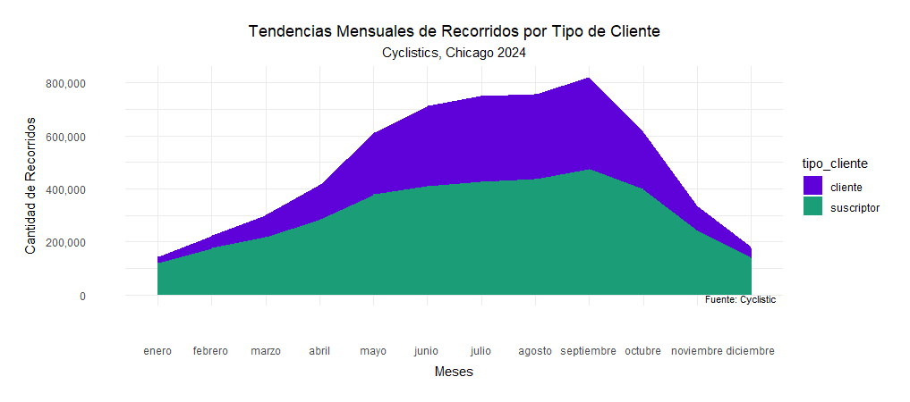
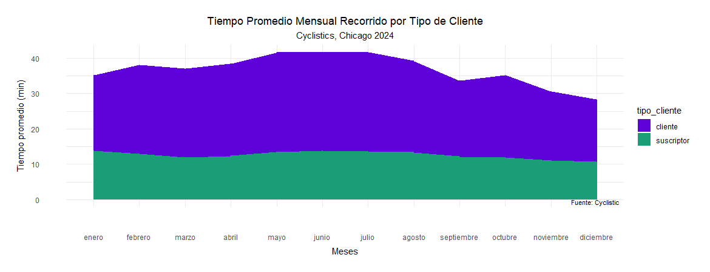
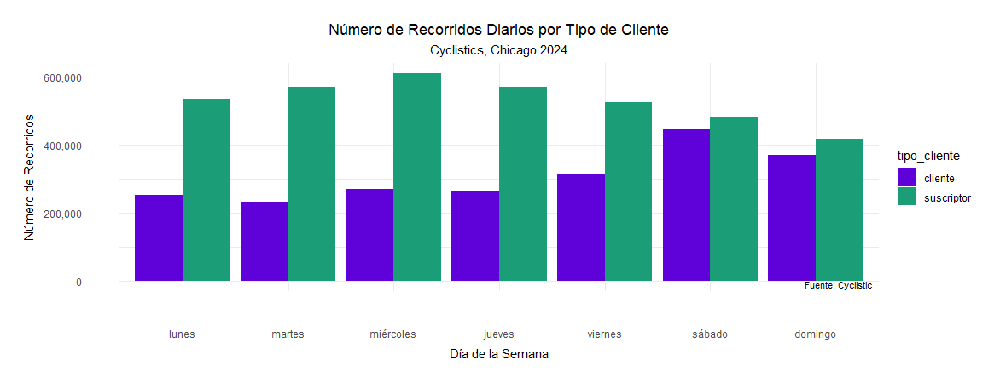
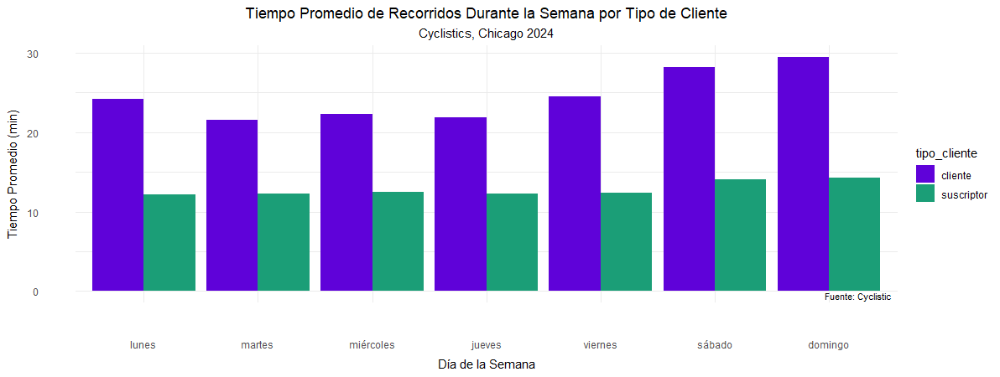

# 🚴🏻‍♀️PROYECTO CYCLISTICS CHICAGO 2024

---
title: "README.RD"
author: "marely"
date: "2025-01-18"
---

## Descripción del Proyecto

Este proyecto tiene como objetivo analizar datos de viajes realizados en el sistema de bicicletas compartidas **Cyclistics** durante el año 2024. El análisis se centra en entender cómo difieren los patrones de uso entre los clientes y los suscriptores para diseñar estrategias de marketing orientadas a convertir a los clientes en suscriptores. Los resultados del análisis respaldarán recomendaciones estratégicas para maximizar los ingresos y la sostenibilidad del programa.

## Escenario

### Contexto Organizacional

Cyclistics es un programa de bicicletas compartidas en Chicago con una flota de 5,824 bicicletas y 692 estaciones. El programa destaca por su flexibilidad de precios y la variedad de bicicletas, que incluyen opciones tradicionales y asistidas para personas con discapacidad. Aunque la mayoría de los usuarios utilizan bicicletas tradicionales y alrededor del 30% las usa para desplazamientos laborales diarios, el programa busca crecer mediante la conversión de clientes en suscriptores.

## Estructura del Proyecto

El proyecto se organiza en dos scripts principales:

1.  **Preparación y Limpieza de Datos** (`preparacion-limpieza-cyclistics.R`): Combina archivos CSV, limpia los datos y los prepara para el análisis.

2.  **Análisis y Visualización de Datos** (`analisis-cyclistics.R`): Realiza análisis descriptivos y genera visualizaciones clave.

## Requisitos del Entorno

**Lenguaje R, versión 4.4.2**

Asegúrese de tener instalados los siguientes paquetes de R:

-   `tidyverse`

-   `lubridate`

-   `ggplot2`

-   `scales`

## Instrucciones

### 1. Preparación y Limpieza de Datos

#### Pasos principales:

1.  **Cargar archivos CSV:** Los archivos de datos de origen están ubicados en la carpeta `data/data-meses`.

2.  **Combinación de datos:** Todos los archivos CSV se combinan en un único DataFrame.

3.  **Limpieza:**

    -   Se eliminan columnas innecesarias (`start_lat`, `start_lng`, `end_lat`, `end_lng`).

    -   Se renombran columnas para mayor claridad (e.g., `ride_id` a `id_recorrido`).

    -   Se eliminan registros duplicados y valores negativos en la columna `tiempo_recorrido`.

    -   Se reemplazan valores nulos en columnas relevantes con "Desconocido".

4.  **Transformaciones:**

    -   Se crean nuevas columnas como `mes`, `dia_semana` y `tiempo_recorrido`.

    -   Se formatean columnas de texto para garantizar consistencia.

    -   Se eliminan conflictos en las columnas relacionadas con estaciones.

5.  **Exportar datos:** El archivo limpio final se guarda como `2024-tripdata-clean.csv` en la carpeta `data`.

6.  Ejecute el script:

```         
source("preparacion-limpieza-cyclistics.R") 
```

### 2. Análisis y Visualización de Datos

#### Pasos principales:

1.  **Importar datos limpios:** Cargue `2024-tripdata-clean.csv`.

2.  **Análisis descriptivo:**

    -   Tiempo promedio, máximo, mínimo y mediano de recorrido.

    -   Comparaciones entre usuarios "clientes" y "suscriptores".

3.  **Visualizaciones:**

    -   Tendencias mensuales de recorridos por tipo de usuario.

    -   Tiempo promedio mensual de recorrido.

    -   Número de recorridos por día de la semana.

    -   Tiempo promedio de recorridos por día de la semana.

4.  Las visualizaciones se generan con `ggplot2`, utilizando paletas de colores personalizadas para distinguir tipos de usuarios.

5.  Ejecute el script:

```         
source("analisis-cyclistics.R") 
```

### 3. Resultados y Visualizaciones

-   **Gráficos mensuales:**

    -   Tendencias de recorridos mensuales para clientes y suscriptores

        

    -   Tiempo promedio de recorrido por mes para "clientes" y "suscriptores".

        

-   

-   **Gráficos semanales:**

    -   Número de recorridos diarios.

        

    -   Tiempo promedio diario de recorridos.

        

Los gráficos incluyen anotaciones y un formato visual uniforme.

## Conclusiones

### Diferencias en el uso entre clientes y suscriptores

1.  **Frecuencia de uso:** Los suscriptores realizan recorridos con mayor frecuencia, mientras que los clientes tienden a utilizarlas principalmente durante fines de semana y meses de verano.

2.  **Duración de los recorridos:** Los clientes registran tiempos de recorrido promedio más largos en comparación con los suscriptores, lo que indica un uso más recreativo.

3.  **Patrones por día de la semana:** Los suscriptores muestran un uso más consistente durante días laborales, lo que sugiere que utilizan las bicicletas para desplazamientos diarios al trabajo.

### Recomendaciones para estrategias de marketing

1.  **Promociones en días laborales:** Incentivar a los clientes a utilizar las bicicletas en días laborales mediante descuentos o beneficios exclusivos para membresías anuales.

2.  **Campañas educativas:** Resaltar los beneficios económicos y de conveniencia de las membresías anuales en comparación con los pases ocasionales.

3.  **Programas de fidelización:** Crear incentivos para los clientes frecuentes, como créditos aplicables a una membresía anual.

### Impacto en la estrategia de marketing

Estas conclusiones respaldan el diseño de campañas específicas para convertir a clientes en suscriptores, alineándose con el objetivo de maximizar ingresos y garantizar la sostenibilidad del programa.

## Archivos Incluidos

-   `preparacion-limpieza-cyclistics.R`: Script para preparación y limpieza de datos.

-   `analisis-cyclistics.R`: Script para análisis y visualización de datos.

-   Carpeta `data`: Contiene archivos CSV de origen y los datos limpios procesados.

## Consideraciones

-   Este proyecto está diseñado para ser ejecutado en un entorno local con soporte para R.

-   Revise los nombres de las carpetas y asegúrese de que coincidan con las rutas especificadas en los scripts.

-   El análisis debe alinearse con el objetivo principal de la empresa: aumentar el número de suscriptores.

    ## Créditos

-   Datos proporcionados por Cyclistics, Chicago 2024.

Si tiene preguntas o necesita soporte, no dude en contactarme. ¡Gracias por explorar este análisis!

